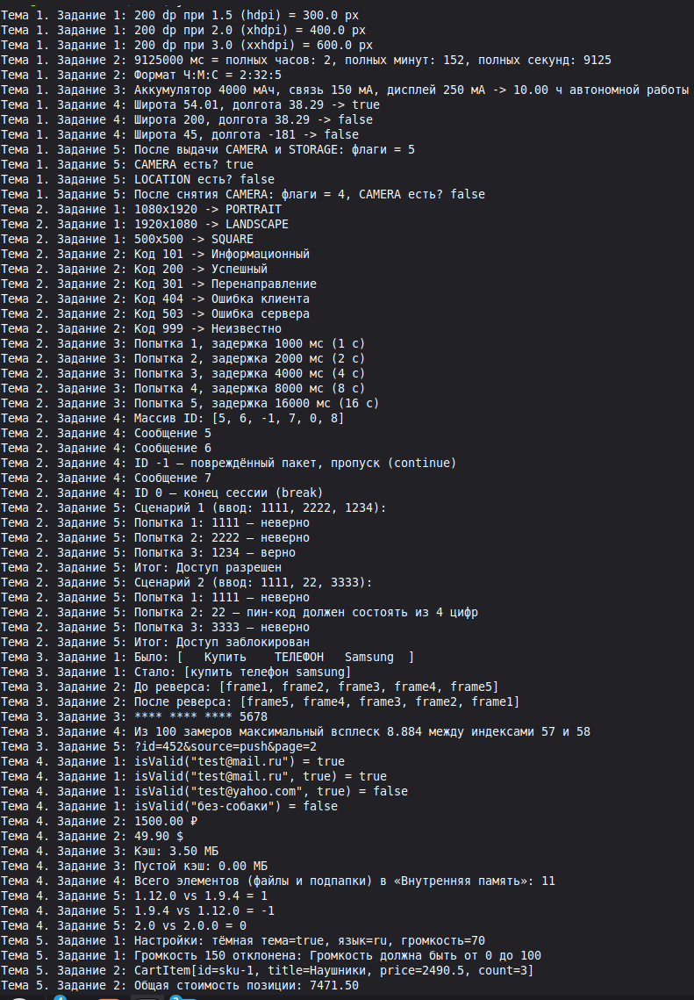
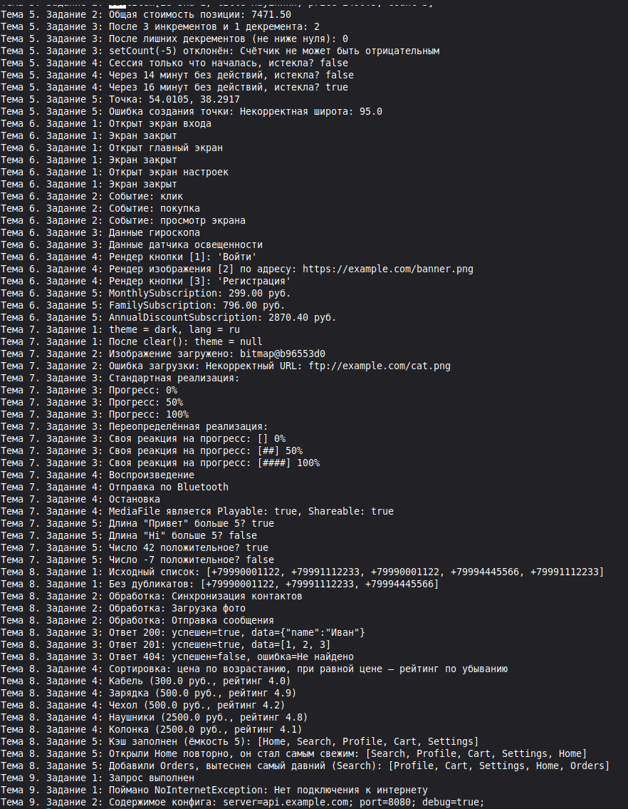
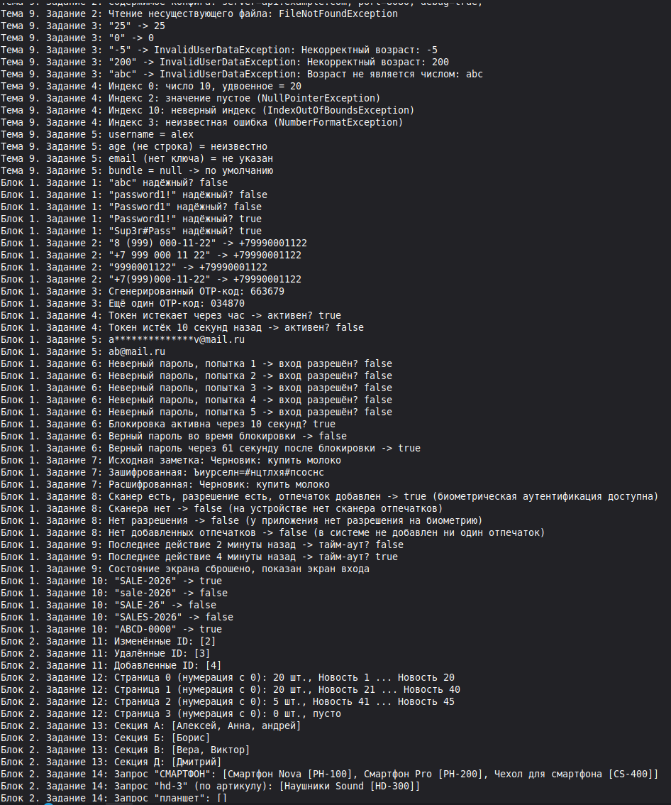
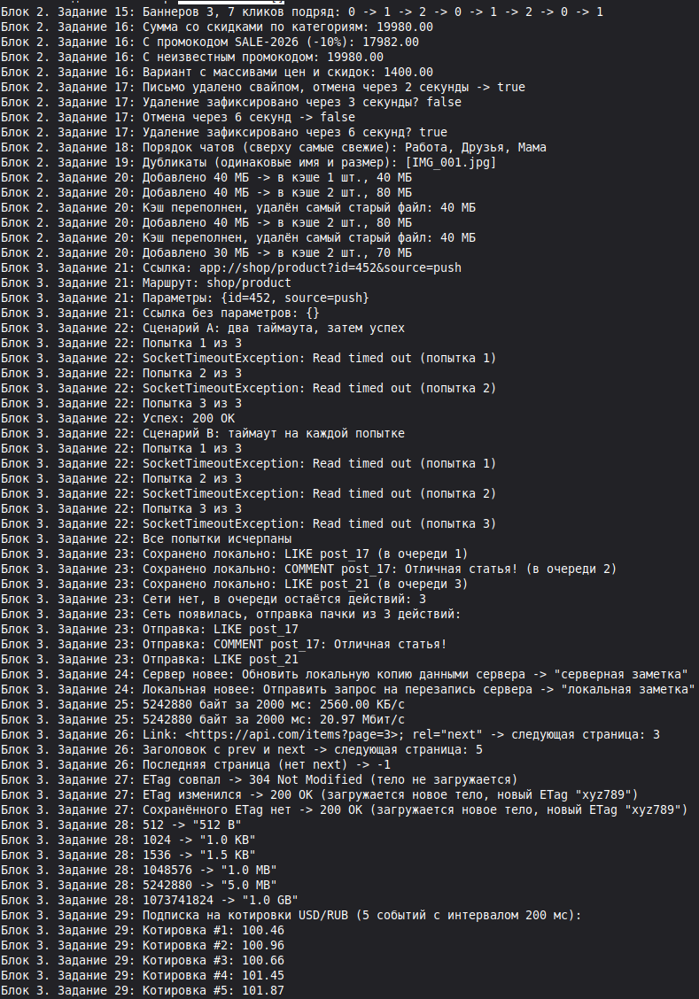
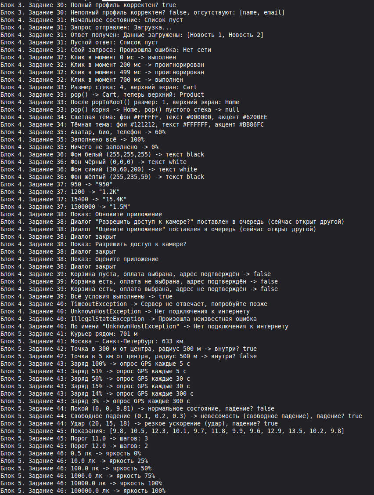
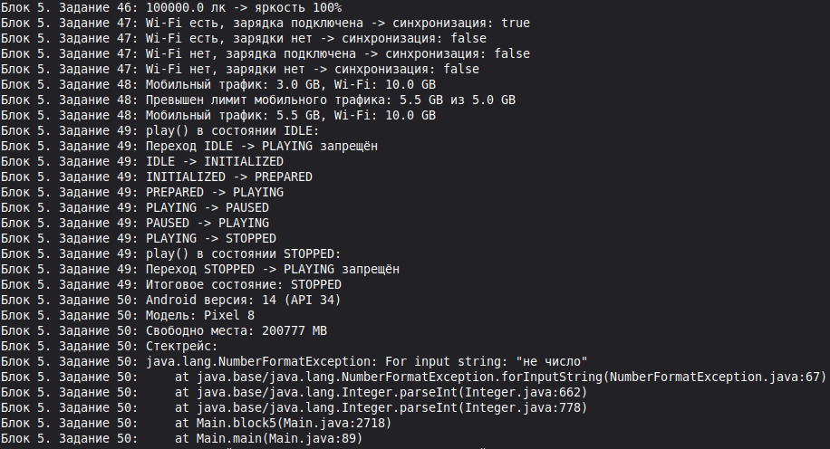

# Практическая работа №2. Задания

*Java для Android-разработки — список заданий со скриншотами результатов*

# Тема 1. Базовый синтаксис, примитивные типы и операторы

**Тема 1. Задание 1: Конвертер плотности (dp в px)**

Напишите программу, принимающую значение размера в dp и коэффициент плотности экрана dpi (например, 1.5 для hdpi, 2.0 для xhdpi, 3.0 для xxhdpi), и вычисляющую пиксели.

**Тема 1. Задание 2: Парсинг таймстемпа**

Создайте переменную типа long, содержащую миллисекунды. Вычислите количество полных минут, секунд и часов без использования сторонних библиотек времени.

**Тема 1. Задание 3: Расчет расхода батареи**

Дана емкость аккумулятора смартфона (мАч) и среднее потребление модуля связи (мА) и дисплея (мА). Рассчитайте ориентировочное время автономной работы в часах.

**Тема 1. Задание 4: Валидатор диапазона координат**

Реализуйте проверку широты (от -90.0 до 90.0) и долготы (от -180.0 до 180.0) через логические операторы && и \|\|.

**Тема 1. Задание 5: Побитовые флаги разрешений**

Реализуйте установку, снятие и проверку разрешений приложения (CAMERA = 1, LOCATION = 2, STORAGE = 4) с помощью побитовых операций (\|, &, \~).

# Тема 2. Управляющие конструкции и операторы ветвления

**Тема 2. Задание 1: Определение ориентации экрана**

Напишите логику, которая по переданной ширине и высоте окна выводит "PORTRAIT", "LANDSCAPE" или "SQUARE".

**Тема 2. Задание 2: Классификатор статуса HTTP-ответа**

Используя switch, верните категорию ответа сервера по его коду: Информационный (1xx), Успешный (2xx), Перенаправление (3xx), Ошибка клиента (4xx), Ошибка сервера (5xx).

**Тема 2. Задание 3: Симулятор таймера повторных попыток (Backoff)**

С помощью цикла for смоделируйте 5 попыток подключения к серверу с экспоненциальной задержкой (1с, 2с, 4с, 8с, 16с).

**Тема 2. Задание 4: Пропуск поврежденных пакетов**

Дан цикл прохода по массиву идентификаторов сообщений чата. Если ID равен -1 (ошибка), выполните continue. Если ID равен 0 (конец сессии), выполните break.

**Тема 2. Задание 5: Контроль ввода пин-кода**

Используя цикл do-while, реализуйте логику проверки 4-значного кода с ограничением до 3 попыток.

# Тема 3. Массивы, строки и форматирование данных

**Тема 3. Задание 1: Нормализация поискового запроса**

Напишите метод, очищающий введенный пользователем поисковый запрос от лишних концевых пробелов, приводящий строку к нижнему регистру и заменяющий множественные пробелы на один.

**Тема 3. Задание 2: Реверс массива кадров анимации**

Дан массив строковых имен кадров анимации. Разверните его задом наперед без создания второго массива.

**Тема 3. Задание 3: Маскирование номера банковской карты**

Примите строку из 16 цифр и верните ее в формате \*\*\*\* \*\*\*\* \*\*\*\* 1234.

**Тема 3. Задание 4: Поиск пиковых значений акселерометра**

В массиве из 100 значений измерений датчика найдите максимальный всплеск (максимальную разность между соседними элементами).

**Тема 3. Задание 5: Генератор URL-параметров**

Дан строковый массив ключей и массив значений одинаковой длины. Соберите строку GET-запроса вида ?key1=val1&key2=val2 с использованием StringBuilder.

# Тема 4. Методы и модульность

**Тема 4. Задание 1: Перегрузка валидатора**

Напишите метод isValid(String email) и его перегруженную версию isValid(String email, boolean checkDomain).

**Тема 4. Задание 2: Форматирование валюты**

Реализуйте метод с параметрами double amount и String currencySymbol, возвращающий красиво оформленную строку для корзины магазина.

**Тема 4. Задание 3: Калькулятор суммарного размера кэша**

Создайте метод calculateCache(long... fileSizesInBytes), возвращающий сумму всех файлов в мегабайтах (double).

**Тема 4. Задание 4: Рекурсивный поиск вложений**

Напишите рекурсивный метод для подсчета общего количества элементов во вложенной структуре папок устройства.

**Тема 4. Задание 5: Сравнение версий приложения**

Напишите метод int compareVersions(String v1, String v2), возвращающий 1, если v1 \> v2, -1, если v1 \< v2, и 0, если версии равны (например, "1.12.0" и "1.9.4").

# Тема 5. Классы, объекты и инкапсуляция

**Тема 5. Задание 1: Модель экрана настроек (SettingsModel)**

Спроектируйте класс с приватными полями isDarkMode, volumeLevel (от 0 до 100) и appLanguage. Обеспечьте валидацию уровня громкости в сеттере.

**Тема 5. Задание 2: DTO корзины интернет-магазина**

Создайте record CartItem(String id, String title, double price, int count). Добавьте в него метод вычисления общей стоимости позиции.

**Тема 5. Задание 3: Счетчик непрочитанных пушей**

Разработайте класс BadgeCounter, в котором значение счетчика нельзя установить в отрицательное число, а инкремент и декремент происходят через отдельные методы.

**Тема 5. Задание 4: Инкапсулированный таймер сессии**

Создайте класс SessionTracker с приватными полями времени входа и последнего действия. Напишите метод проверки, истекла ли сессия (timeout = 15 минут).

**Тема 5. Задание 5: Модель геопозиции**

Создайте класс GeoPoint с неизменяемыми полями широты и долготы, валидируемыми в конструкторе.

# Тема 6. Наследование и полиморфизм

**Тема 6. Задание 1: Иерархия экранов приложения**

Создайте базовый класс BaseScreen (с методами onOpen(), onClose()) и наследников: LoginScreen, HomeScreen, SettingsScreen.

**Тема 6. Задание 2: Полиморфный обработчик аналитики**

Реализуйте базовый класс AnalyticsEvent и подклассы ClickEvent, PurchaseEvent, ScreenViewEvent. Напишите сервис, принимающий AnalyticsEvent и выводящий разную логику логирования.

**Тема 6. Задание 3: Модели сенсоров смартфона**

Создайте класс DeviceSensor и наследников GyroscopeSensor и LightSensor. Реализуйте полиморфный метод readData().

**Тема 6. Задание 4: Виджеты с кастомной отрисовкой**

Напишите метод drawScreen(List\<UiComponent\> components), который итерируется по коллекции и вызывает метод render() для каждого элемента независимо от его типа.

**Тема 6. Задание 5: Тарифные планы подписки**

Создайте базовый класс Subscription с расчетом стоимости и подклассы: MonthlySubscription, FamilySubscription (с учетом количества пользователей), AnnualDiscountSubscription.

# Тема 7. Абстрактные классы и интерфейсы

**Тема 7. Задание 1: Контракт хранилища данных**

Создайте интерфейс KeyValueStorage с методами save(String key, String value), get(String key), clear(). Реализуйте класс MemoryStorage.

**Тема 7. Задание 2: Колбэк загрузки изображения**

Напишите интерфейс ImageLoadCallback с методами onSuccess(String bitmapRef) и onError(Throwable error).

**Тема 7. Задание 3: Слушатель жизненного цикла фоновой задачи**

Спроектируйте интерфейс BackgroundTaskListener со стандартным методом onProgress(int percentage).

**Тема 7. Задание 4: Множественная реализация**

Создайте класс MediaFile, реализующий два интерфейса: Playable (метод play(), stop()) и Shareable (метод shareViaBluetooth()).

**Тема 7. Задание 5: Функциональный интерфейс для фильтрации**

Напишите аннотированный @FunctionalInterface PredicateValidator\<T\> с методом boolean validate(T data) и протестируйте его через лямбда-выражение.

# Тема 8. Коллекции и Generics

**Тема 8. Задание 1: Удаление дубликатов контактов**

Дан список телефонных номеров с дубликатами. Используя Set, верните очищенную от повторов коллекцию с сохранением исходного порядка добавления (LinkedHashSet).

**Тема 8. Задание 2: Очередь сетевых запросов**

Реализуйте имитацию очереди синхронизации данных Queue\<String\> (FIFO), обрабатывая элементы по мере поступления.

**Тема 8. Задание 3: Обобщенный ответ API (Generic ApiResponse)**

Создайте класс ApiResponse\<T\> с полями int statusCode, T data, String errorMessage и булевым геттером isSuccessful().

**Тема 8. Задание 4: Сортировка товаров по цене и популярности**

Дан List\<Product\>. Отсортируйте коллекцию с помощью Comparator сначала по возрастанию цены, а при равной цене — по рейтингу.

**Тема 8. Задание 5: Кэш экранов (LRU Cache концепт)**

Спроектируйте простейший механизм кэширования последних открытых фрагментов с ограничением максимальной емкости в 5 элементов.

# Тема 9. Исключения и безопасность выполнения

**Тема 9. Задание 1: Пользовательское исключение отсутствия сети**

Создайте проверяемое исключение NoInternetException и напишите метод имитации запроса, выбрасывающий его при флаге hasConnection == false.

**Тема 9. Задание 2: Конструкция try-with-resources**

Напишите метод чтения файла локального конфига с автоматическим закрытием потока ввода (BufferedReader).

**Тема 9. Задание 3: Парсинг JSON-поля возраста**

Реализуйте метод int parseAge(String ageStr), выбрасывающий непроверяемое исключение InvalidUserDataException, если возраст отрицательный или превышает 130.

**Тема 9. Задание 4: Множественные блоки catch**

Напишите блок обработки try-catch, раздельно обрабатывающий NullPointerException, IndexOutOfBoundsException и общий Exception.

**Тема 9. Задание 5: Безопасное извлечение значения из Bundle**

Напишите утилитный метод, безопасно читающий строковое значение по ключу, возвращающий значение по умолчанию при возникновении любой ошибки.

# Практические задания

# Блок 1: Авторизация, безопасность и валидация ввода

**Блок 1. Задание 1: Валидатор надежности пароля**

Проверьте пароль на соответствие критериям: минимум 8 символов, хотя бы одна заглавная буква, одна цифра и один специальный знак (!@\#$%^&\*).

**Блок 1. Задание 2: Нормализатор телефонных номеров**

Принимайте строку в произвольном формате (например, 8 (999) 000-11-22 или +7 999 000 11 22) и приводите её к строгому стандарту E.164 (+79990001122).

**Блок 1. Задание 3: Генератор одноразового SMS-кода**

Напишите метод генерации 6-значного числового OTP-кода.

**Блок 1. Задание 4: Проверка срока действия JWT-токена**

Дан Unix-таймстемп истечения токена в секундах. Определите, активен ли токен относительно текущего системного времени.

**Блок 1. Задание 5: Маскировка персональных данных (PII)**

Замаскируйте адрес электронной почты: alexander.ivanov@mail.ru -\> a\*\*\*\*\*\*\*\*\*\*\*v@mail.ru.

**Блок 1. Задание 6: Блокировщик брутфорса**

Реализуйте класс LoginThrottler, который после 5 неудачных попыток ввода пароля блокирует ввод на 60 секунд.

**Блок 1. Задание 7: Шифратор перестановкой для локальных заметок**

Напишите простейший обратимый шифратор строк для сокрытия черновиков в локальной базе.

**Блок 1. Задание 8: Проверка биометрической готовности**

Напишите логику оценки возможности аутентификации по отпечатку пальца на основе набора булевых флагов оборудования и разрешений.

**Блок 1. Задание 9: Контроль сессии по тайм-ауту**

Реализуйте сброс состояния экрана в случае неактивности пользователя более 3 минут.

**Блок 1. Задание 10: Валидатор промокода**

Проверьте правильность промокода по маске: 4 заглавные латинские буквы, дефис, 4 цифры (например, SALE-2026).

# Блок 2: Работа со списками, каталогами и кэшем (RecyclerView Logic)

**Блок 2. Задание 11: DiffUtil-компаратор элементов списка**

Напишите метод, принимающий старый и новый списки элементов NewsItem и возвращающий список ID измененных и удаленных позиций.

**Блок 2. Задание 12: Пагинация ленты новостей**

Напишите класс PaginationHelper, который по номеру страницы page и размеру страницы pageSize = 20 извлекает нужный срез из общего массива новостей.

**Блок 2. Задание 13: Группировка контактов по первой букве**

Дан список имен. Сгруппируйте их в Map\<Character, List\<String\>\> для отображения заголовков секций.

**Блок 2. Задание 14: Полнотекстовый фильтр списка**

Реализуйте метод фильтрации каталога товаров по вхождению подстроки в наименование или артикул без учета регистра.

**Блок 2. Задание 15: Карусель промо-баннеров**

Реализуйте циклическое получение следующего элемента баннера по индексу текущего клика.

**Блок 2. Задание 16: Подсчет суммарной стоимости корзины с учетом промокода**

Рассчитайте сумму позиций с учетом скидок на отдельные категории товаров.

**Блок 2. Задание 17: Удаление свайпом с возможностью отмены (Undo)**

Спроектируйте логику временного буфера удаленного элемента списка с таймером фиксации удаления.

**Блок 2. Задание 18: Сортировка чатов по времени последнего сообщения**

Отсортируйте список диалогов так, чтобы сверху оказались диалоги с самыми свежими сообщениями.

**Блок 2. Задание 19: Поиск дубликатов в галерее по контрольной сумме**

Напишите алгоритм поиска повторяющихся файлов по размеру и имени.

**Блок 2. Задание 20: Ограничитель емкости кэша картинок**

Реализуйте стратегию вытеснения самого старого файла (FIFO), если суммарный объем картинок превысил 100 МБ.

# Блок 3: Сеть, парсинг данных и офлайн-синхронизация

**Блок 3. Задание 21: Парсер параметров диплинка (Deep Link)**

Извлеките параметры маршрутизации из URL вида app://shop/product?id=452&source=push.

**Блок 3. Задание 22: Симулятор Retry-политики запроса**

Смоделируйте выполнение сетевого вызова с 3 повторами при возникновении SocketTimeoutException.

**Блок 3. Задание 23: Очередь отложенных офлайн-действий**

Создайте класс OfflineActionQueue, сохраняющий лайки и комментарии при отсутствии сети и отправляющий их пачкой при подключении.

**Блок 3. Задание 24: Слияние локальных данных с сервером (Conflict Resolver)**

Напишите резолвер конфликта версии заметки: если серверная версия новее локальной, обновлять локальную, иначе отправлять запрос на перезапись.

**Блок 3. Задание 25: Оценка скорости скачивания файла**

По количеству байт и времени в миллисекундах рассчитайте скорость передачи в КБ/с и Мбит/с.

**Блок 3. Задание 26: Парсинг заголовков пагинации сервера**

Извлеките из заголовка Link: \<https://api.com/items?page=3\>; rel="next" номер следующей страницы.

**Блок 3. Задание 27: Проверка актуальности кэша по ETag**

Реализуйте логику: если переданный ETag совпадает с сохраненным, возвращать ответ 304 Not Modified без загрузки тела.

**Блок 3. Задание 28: Форматирование байтов в читаемый вид**

Переведите число байт в строку: 1024 -\> "1.0 KB", 1048576 -\> "1.0 MB", 1536 -\> "1.5 KB".

**Блок 3. Задание 29: Имитация веб-сокета для биржевого виджета**

Напишите интерфейс слушателя котировок валют и генератор событий с интервалом.

**Блок 3. Задание 30: Валидатор ответа API**

Напишите метод проверки обязательных полей JSON-объекта профиля на null.

# Блок 4: Управление состоянием экрана и UI-архитектура

**Блок 4. Задание 31: Конечный автомат экрана загрузки (UI State MVI)**

Реализуйте переключение состояний экрана через sealed-иерархию или enum: Loading, Success(data), Empty, Error(message).

**Блок 4. Задание 32: Дебаунсер кликов (Anti-Double Click)**

Напишите класс-обертку над кликом, предотвращающий повторный вызов действия, если с момента прошлого клика прошло менее 500 мс.

**Блок 4. Задание 33: Стек навигации экранов (BackStack)**

Реализуйте собственную структуру данных стека экранов с поддержкой операций push(Screen), pop() и popToRoot().

**Блок 4. Задание 34: Моделирование темной и светлой темы**

Спроектируйте класс ThemePalette, возвращающий шестнадцатеричные коды цветов (HEX) в зависимости от выбранного режима оформления.

**Блок 4. Задание 35: Расчет прогресса заполнения профиля**

Определите процент заполненности аккаунта пользователя (аватар, био, телефон, почта, город).

**Блок 4. Задание 36: Инвертор цвета текста для контрастности**

По заданному цвету фона (RGB) вычислите, какой цвет текста отображать для читаемости — белый или черный (по формуле яркости YIQ).

**Блок 4. Задание 37: Форматирование счетчика лайков**

Переведите большие числа в сокращения: 950 -\> "950", 1200 -\> "1.2K", 1500000 -\> "1.5M".

**Блок 4. Задание 38: Менеджер системных диалогов**

Реализуйте класс очереди показа диалоговых окон, исключающий перекрытие одного всплывающего окна другим.

**Блок 4. Задание 39: Валидатор состояния кнопки "Оплатить"**

Кнопка активна только при условии: корзина не пуста, выбран способ оплаты, адрес доставки подтвержден.

**Блок 4. Задание 40: Транслятор ошибок для пользователя**

Напишите метод, переводящий системные исключения (TimeoutException, UnknownHostException) в понятные человекочитаемые подсказки на русском языке.

# Блок 5: Аппаратные функции, геолокация и фоновые задачи

**Блок 5. Задание 41: Расчет расстояния между двумя GPS-точками**

Реализуйте формулу гаверсинусов (Haversine formula) для определения дистанции в метрах между координатами пользователя и курьера.

**Блок 5. Задание 42: Определитель вхождения в геозону (Geofencing)**

Напишите метод, определяющий, находится ли точка с координатами (lat, lon) внутри окружности радиуса R с центром в (centerLat, centerLon).

**Блок 5. Задание 43: Энергосберегающий планировщик геолокации**

Изменяйте частоту опроса датчика GPS в зависимости от уровня заряда батареи: \> 50% (каждые 5 сек), 15-50% (каждые 30 сек), \< 15% (раз в 5 минут).

**Блок 5. Задание 44: Детектор падения смартфона (акселерометр)**

Напишите алгоритм, определяющий состояние невесомости / резкого ускорения по 3 осям (X, Y, Z) при превышении критического порога.

**Блок 5. Задание 45: Шагомер на основе пиковых амплитуд**

Дан массив показаний вертикального ускорения. Подсчитайте количество совершенных шагов по локальным максимумам выше заданного барьера.

**Блок 5. Задание 46: Контроллер яркости по датчику освещенности**

Преобразуйте люксы (Lux) внешнего освещения в процент яркости экрана (0-100%) по логарифмической шкале.

**Блок 5. Задание 47: Планировщик фоновой синхронизации данных**

Проверьте совокупность системных условий для старта тяжелой синхронизации: подключение к Wi-Fi + устройство подключено к зарядному устройству.

**Блок 5. Задание 48: Монитор расхода мобильного трафика**

Спроектируйте класс, суммирующий трафик раздельно для мобильной сети и Wi-Fi с предупреждением при достижении лимита в 5 ГБ.

**Блок 5. Задание 49: Плеер аудиофайлов (State Machine)**

Смоделируйте жизненный цикл аудиоплеера: IDLE -\> INITIALIZED -\> PREPARED -\> PLAYING -\> PAUSED -\> STOPPED. Блокируйте недопустимые переходы.

**Блок 5. Задание 50: Логгер крашей приложения**

Реализуйте запись стектрейса ошибки, версии Android, модели смартфона и свободного места на накопителе в форматированный отчет об аварийном завершении.

